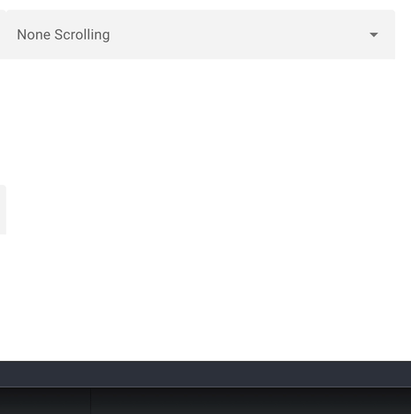
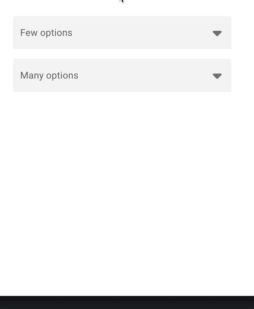

# QSelect: Constrain menu max-width

### Account for appearing/disappearing menu scrollbars

#### Problem

This fix handles the case where scrollbars appear or disappear while the select menu is open. (Code from https://codepen.io/metalsadman/pen/PoOvqBB)



#### Fix

To demonstrate fix, click the 'Few options' select to open its menu, then drag the bottom of window to shorten the viewport until the menu has scrollbars. Notice that the menu items reactively change width to adjust for the appearance/disappearance of the scrollbar in the menu. [View in Stackblitz ⚡️](https://stackblitz.com/~/github.com/loyaj/quasar-select-menu-scrollbar-fix?file=src/pages/IndexPage.vue,src/components/menuWidth.js,src/components/SelectField.vue)



This fix is based on code linked by [@metalsadman](https://github.com/metalsadman) in the github issues below. Fix developed and tested with chrome 128 on macos 14.6 with "Show scroll bars" set to "Always" in system preferences.

### Related github issues

- [[Q-Select] Dropdown width for long option items](https://github.com/quasarframework/quasar/discussions/12617)
- [Q-Select dropdown menu over size](https://github.com/quasarframework/quasar/issues/12678)
- [[Q-Select] drop down width cannot be set](https://github.com/quasarframework/quasar/discussions/16630)

## Install the dependencies

```bash
yarn
# or
npm install
```

### Start the app in development mode (hot-code reloading, error reporting, etc.)

```bash
quasar dev
```
